# Random Dungeon Generator

> **Work in Progress** – This project is actively being developed. Features may be incomplete or subject to change.

A 2D procedural dungeon generation game built in Unity. The goal is to create a fully explorable dungeon with dynamic room layouts, enemies, and atmospheric effects.

## Implemented so far

All features listed below are in an early, rudimentary state and still being iterated on.

- **Procedural dungeon generation** – Rooms are placed using a queue-based algorithm with a configurable distribution factor to control dungeon spread
- **Fog of war** – Unexplored rooms and their surrounding areas are hidden and revealed as the player explores
- **Sliding doors** – Doors physically slide open when a room is cleared and close again when the player enters a new room
- **Enemy encounters** – An enemy spawns in each room the player enters; doors close until the enemy is defeated
- **Edit mode preview** – The dungeon can be previewed in the Unity Editor without entering Play mode

## Systems Overview

| System | Description |
|---|---|
| `RoomGenerator` | Procedurally places rooms on a grid |
| `DoorGenerator` | Creates doors between adjacent rooms |
| `PlayerGenerator` | Spawns the player (center, random, or edge room) |
| `EnemyManager` | Spawns and tracks enemies per room |
| `DoorManager` | Opens/closes doors based on game state |
| `FogOfWarManager` | Manages fog overlays for unexplored rooms |
| `RoomManager` | Tracks the player's current room and cleared rooms |

## Configuration

Dungeon parameters are controlled via the `DungeonConfig` ScriptableObject:

- **Room size** – Default 32×18 tiles
- **Number of rooms** – Default 25
- **Room distribution factor** – Controls how rooms spread from center
- **Door width / depth** – Default 4 wide, 2 deep
- **Player spawn location** – `CenterRoom`, `RandomRoom`, or `EdgeRoom`

## Project Structure

```mermaid
graph TD
    ROOT[Random Dungeon Generator] --> SCRIPTS(Scripts/)

    SCRIPTS --> CORE(Core/)
    SCRIPTS --> GENERATORS(Generators/)
    SCRIPTS --> MANAGERS(Managers/)
    SCRIPTS --> CONTROLLER(Controller/)
    SCRIPTS --> MODELS(Models/)

    CORE --> DC["DungeonComposer.cs<br/>Orchestrates the generation pipeline"]
    CORE --> DCFG["DungeonConfig.cs<br/>ScriptableObject with dungeon parameters"]
    CORE --> DCTX["DungeonGenerationContext.cs<br/>Shared data passed between tasks"]

    GENERATORS --> RG["RoomGenerator.cs<br/>Procedurally places rooms on a grid"]
    GENERATORS --> DG["DoorGenerator.cs<br/>Creates doors between adjacent rooms"]
    GENERATORS --> PG["PlayerGenerator.cs<br/>Spawns the player and initializes managers"]
    GENERATORS --> EG["EnemyGenerator.cs<br/>Sets up the enemy system"]

    MANAGERS --> RM["RoomManager.cs<br/>Tracks current room and cleared rooms"]
    MANAGERS --> EM["EnemyManager.cs<br/>Spawns and manages enemies per room"]
    MANAGERS --> DM["DoorManager.cs<br/>Opens and closes doors based on game state"]
    MANAGERS --> FOW["FogOfWarManager.cs<br/>Manages fog overlays for unexplored rooms"]

    CONTROLLER --> DOORC["DoorController.cs<br/>Sliding door animation logic"]
    CONTROLLER --> EC["EnemyController.cs<br/>Enemy AI, health and death events"]
    CONTROLLER --> PC["PlayerController.cs<br/>WASD movement and animation"]
    CONTROLLER --> CC["CameraController.cs<br/>Smooth camera follow"]

    MODELS --> ROOM["Room.cs<br/>Room data: position, size, neighbors, doors"]
    MODELS --> DOOR["Door.cs<br/>Door data: tile positions, connected rooms"]
```



## Setup

After cloning the repository, run the setup script **once**:

```sh
./setup.sh
```

This activates two Git hooks:
- **commit-msg** – enforces the [Conventional Commits](https://www.conventionalcommits.org/) format
- **pre-commit** – checks C# formatting via `dotnet format`

To fix formatting issues automatically before committing:
```sh
dotnet format whitespace Assembly-CSharp.csproj
```

## Requirements

- Unity 2022.3 or newer
